# 汽车销售订单系统

## 依赖

- Docker
- Docker Compose


## 快速开始

```sh
$ curl -fsSL https://github.com/zhongzc/se-project/releases/download/0.1.0/docker-compose.yml -o docker-compose.yml
$ docker-compose up -d
```

- 应用所在页： http://localhost:8000
- RESTful接口页： http://localhost:8500/swagger-ui.html
- GraphQL接口页： http://localhost:8500/graphql-doc/index.html


## 页面展示

### 用户操作

- 商品浏览

进入主页，进行商品浏览。

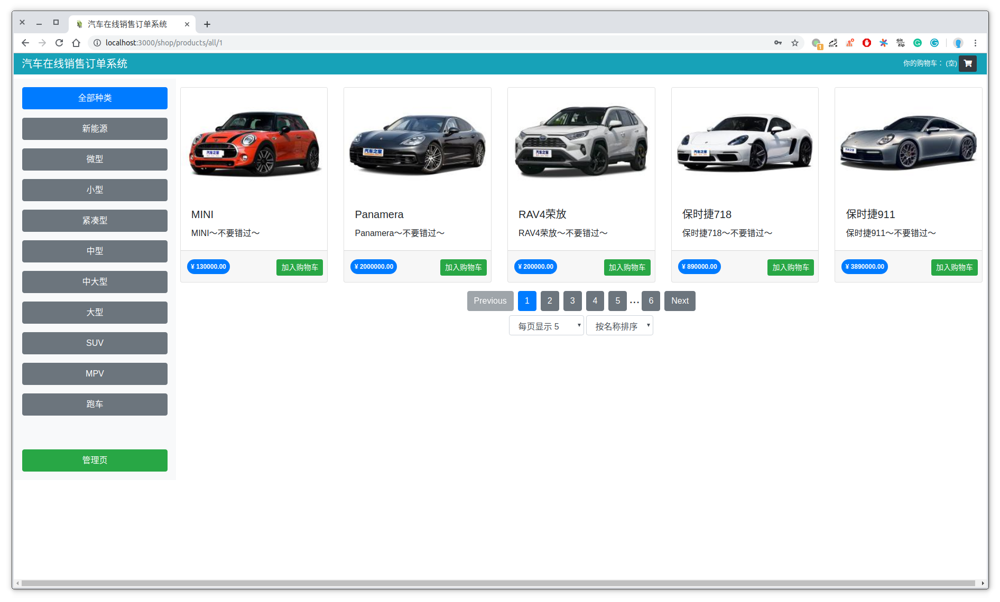

切换每页显示商品数。

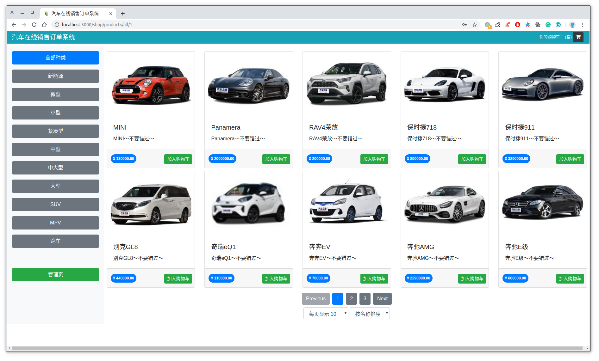

选择不同商品分类。

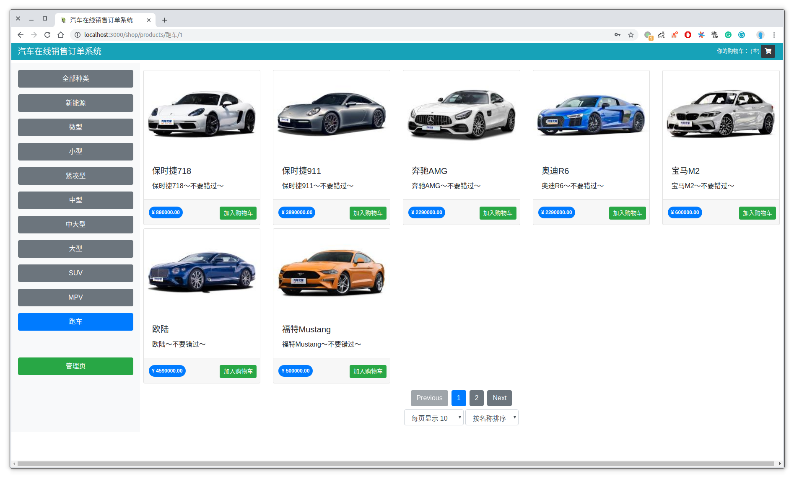

- 购物车

通过点击商品下方加入购物车按钮添加进入购物车。购物车提供总价、数目等信息，以及修改数目、移除商品操作，可选择继续购物或进行结算

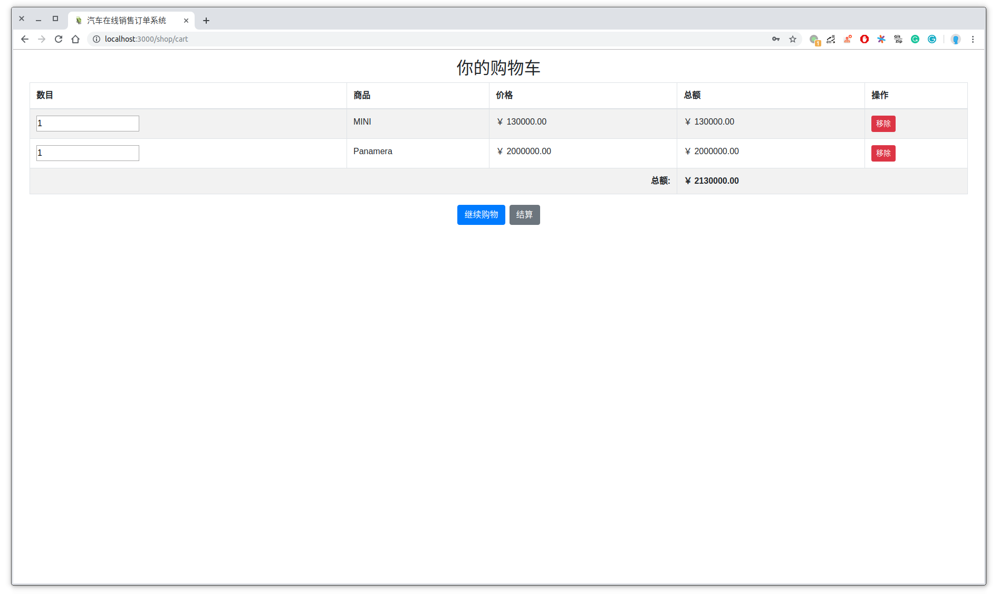

- 订单结算页

用于填写个人信息并提交。

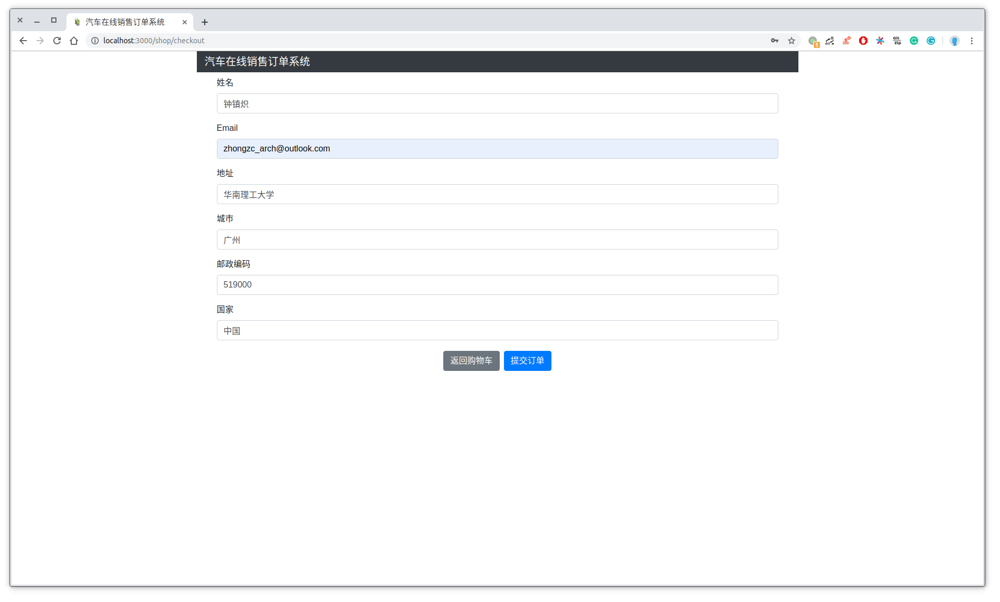

- 订单完成信息

显示订单号。

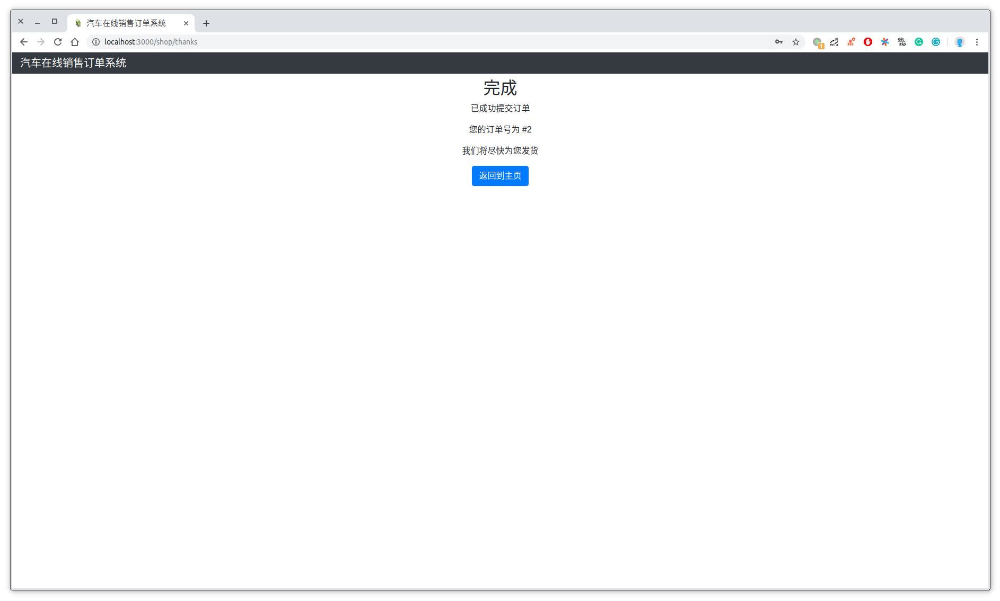

### 管理员操作

通过主页上的管理页按钮进入管理页。

- 管理员登录

账号为admin，密码为admin。

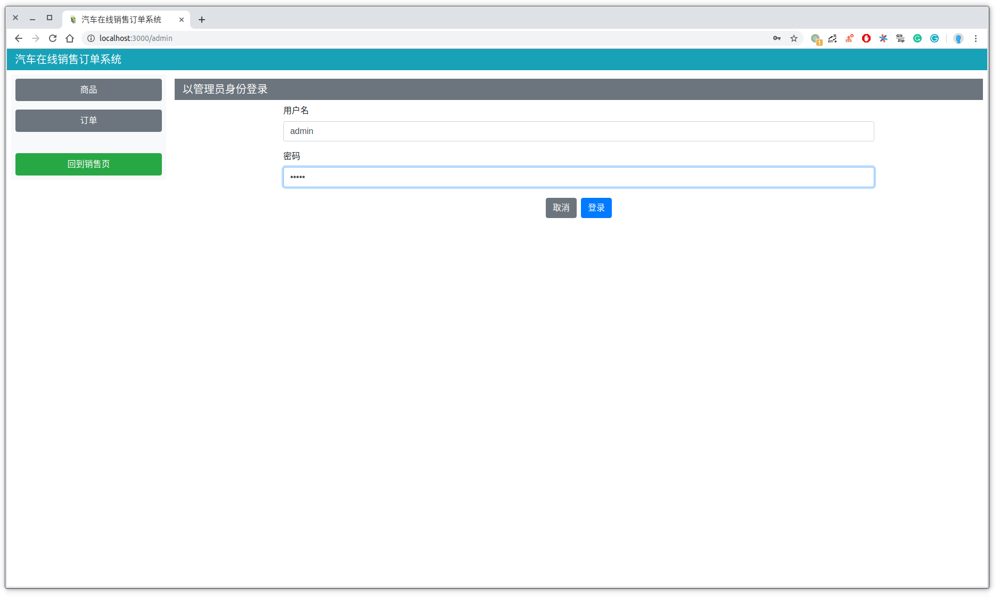

- 商品管理页

显示所有的商品，可选择显示个数和排序。

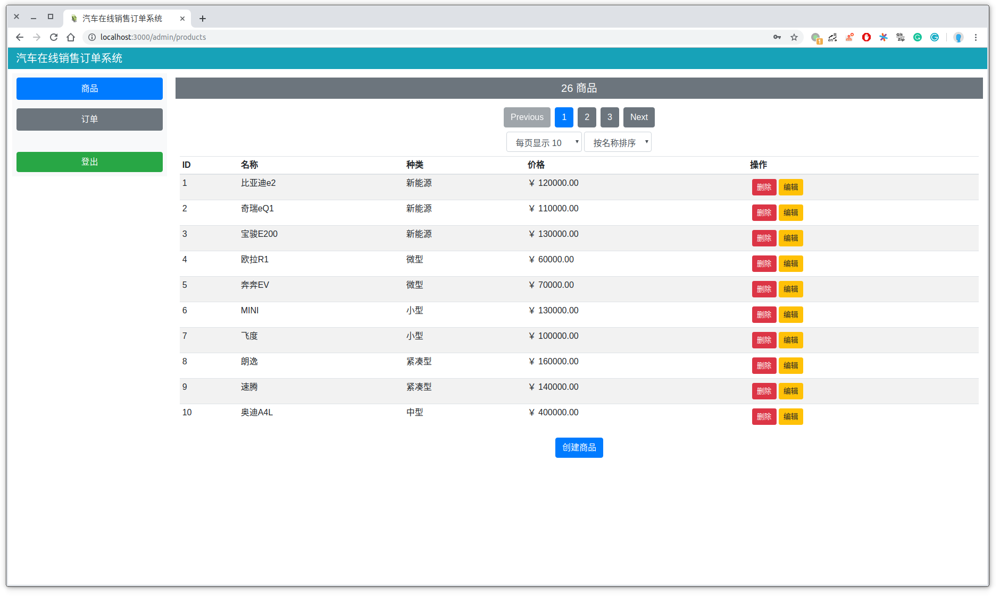

- 商品信息编辑

在管理页选择商品进行编辑，可修改名称、图片地址等信息。

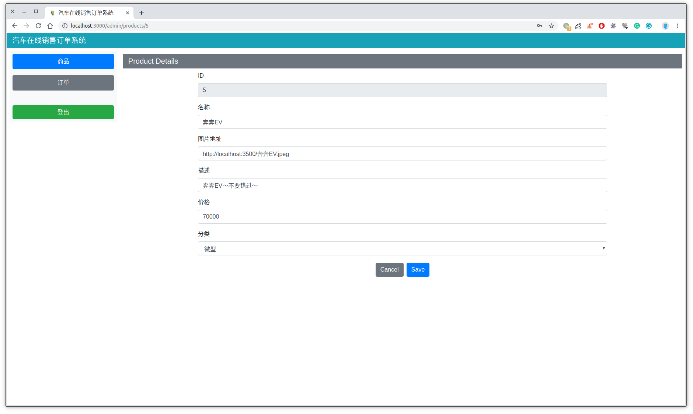

- 新增商品

在管理页底部可选择新增商品，并填写信息以及提交。

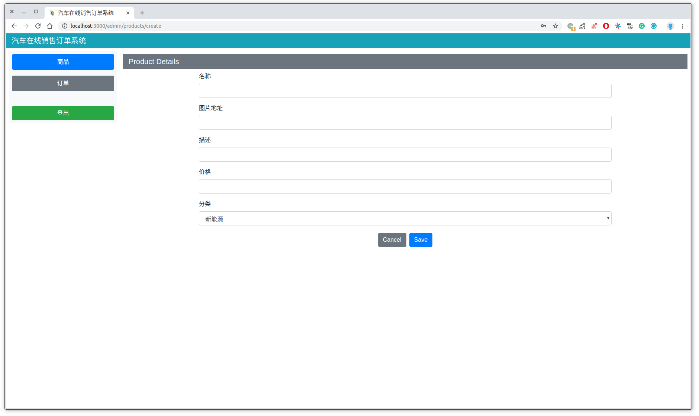

- 订单管理

点击管理页左端订单按钮进入订单管理页。

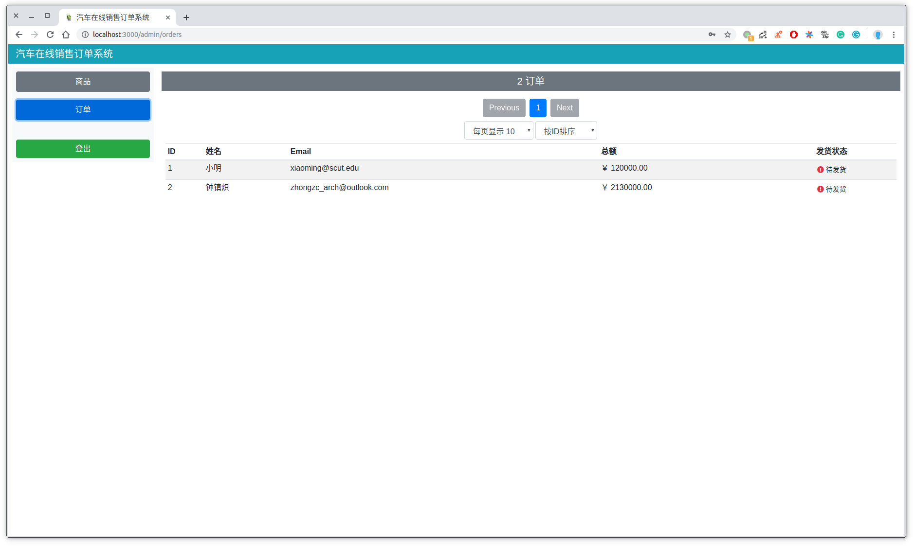

可操作发货按钮，更改发货信息

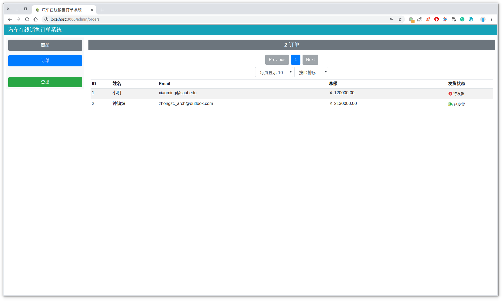
